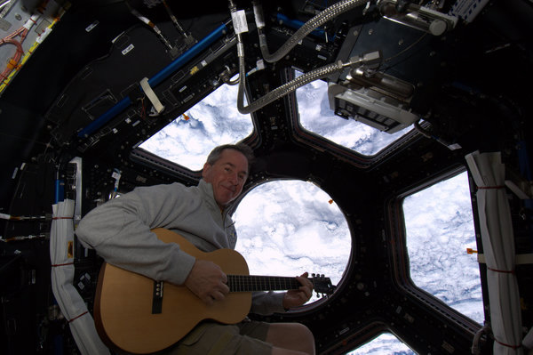
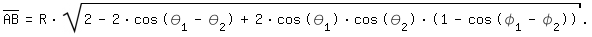
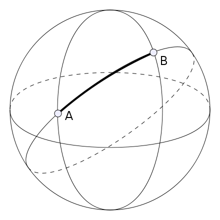
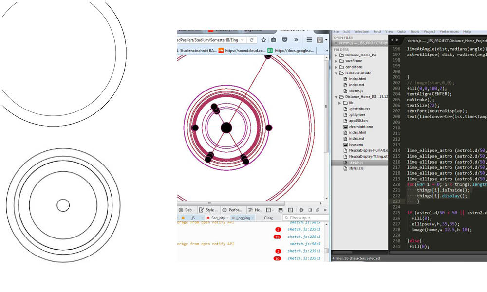
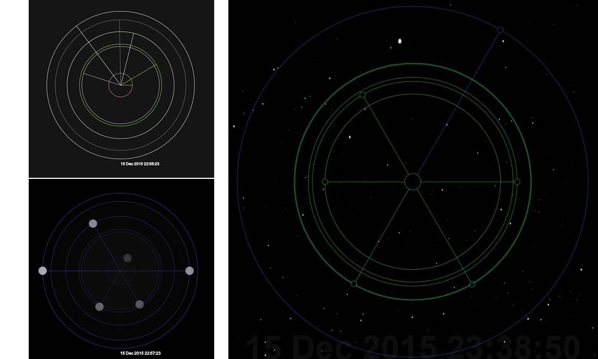
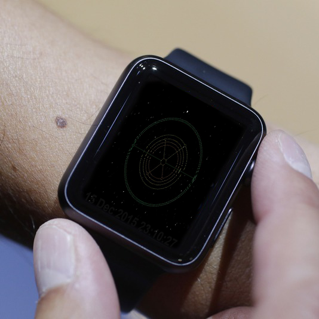

###The Project

This Project, wich took about four weeks was about the visualisation of data. 
The assingnment contained, that we should use the [API of the ISS](http://open-notify.org/Open-Notify-API/ISS-Location-Now/) geo coordinates. Coming from there we should find a good reference data set to visualise.

===

###five finger excercise

After a couple of short excercises to get to know how to handle the JSON format, we faced the first challange. The task was to write a program wich visualises a dataset ,in my case the cookingtimes of vegetables, in a clear way. We worked with the java script library p5js.  
[Here](http://wollemannone.github.io/veggieManiacc-/) you can find the resut of this excercise.  
The whole [GitHub Repo](https://github.com/wollemannone/veggieManiacc-) you can find here.

===

###two ideas | ISS 

  
   
  
  
  After the fist two weeks I was facing two concepts:  
  
  >The **first concept** was concerned about the **scientific experiments**, wich are runned in the ISS. The idea was to
  creat an info grafic, wich shows the financial system behind the research projects. It would make the obserever explore 
  which country or wich organisation invests how much in wich project. Futhermore there should be shown, to what extend 
  the results have an influence of our life on earth. The viewer should see wich money causes wich improvement for the humans and wich scientifec areas actually benefit of the pricey experiments.  
  >
  >
  >Tools:  Ai, Id, Excel, import.io...
  
  

  
  The **second concept** deals with the issue from another perspective. The **personal sensation** when rounding 
  the globe sixteen times a day, was in the center of  this concept. The longing for home is  something wich companies every   traveller more or less. Because of the very divers origins of the ISS team members, there was an interesting fact. The distance to the individual home spot is changing fast, constantly and apparently unattached.  
  There I found the data I wanted to work with. To visualise the distance between the ISS and the home places would be 
  interisting for the astronauts but also for their relatives.   
  
  Tools: API, p5js
  ---
  Due to the fact that I already made some steps in p5js, I wanted to stick to that tool and write a code to create my visualisation.  

===
  
  
  
### Distance | Home - ISS

>Necessary for displaying the distance was a calculation. considering that, the geocoordinates of the home places
>were needed and calculated with the ISS geocoordinates with the following formula.  

 

##### The process

>

===
---

###The application

 As presentation I decided for a circular diagram. All the home spots are bunched is the center. So the individual distance is diametricy.Furthermore the color of the single circle is mapped to the distance home. It gets colder the farer the distance is. The effect is more arty than scientific. But it invites to explore and to understand. Imaginable is a huge, wall filling format in a exhibitional context. With rollover functions you could also display information about the ISS travellers or their origins. Another context could be an App for smartphone or watch. That would be just for the relatives of the astronauts to allway have an idea how far away he actually is.

  
  
  

